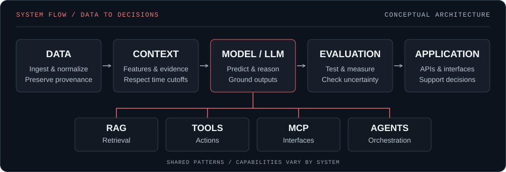
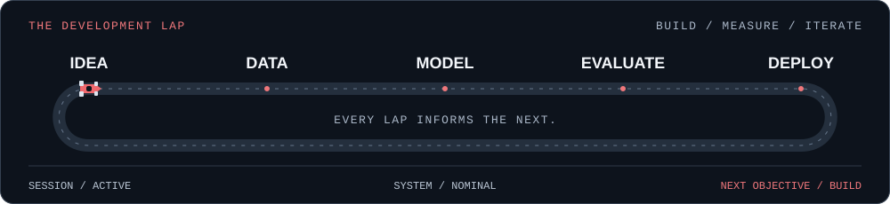

<!-- HERO -->

  

<strong>AI / ML Engineer · Agentic &amp; LLM Systems · Motorsport Analytics</strong>

  <a href="https://github.com/AaditHire/f1-virtual-pitwall-V2">Explore the pit wall</a> &nbsp; / &nbsp;
  <a href="https://linkedin.com/in/aadit-hire">LinkedIn</a> &nbsp; / &nbsp;
  <a href="mailto:hire.aadit@gmail.com">Contact</a>

---

<!-- ABOUT -->
I'm **Aadit**, an AI/ML engineer based in **Mumbai, India** and **Co-Founder & AI/ML Developer at GOCO**. I build race-strategy software, financial research systems, and AI infrastructure around agents, retrieval, and tools.

My engineering focus: preserve temporal integrity, ground responses in evidence, and evaluate the decisions a system makes.

B.Tech in Computer Engineering · DJSCE · 2022–2026 &nbsp; | &nbsp; Away from the terminal: following Formula 1 and cheering for George Russell.

<!-- CURRENT SYSTEMS -->
## 01 // CURRENT DEVELOPMENT

| System | Engineering focus |
| :--- | :--- |
| **F1 Virtual Pitwall V2** | Historical replay, causal features, uncertainty-aware pit strategy |
| **FinPulse** | Financial research, hybrid RAG, specialist agents, MCP infrastructure |
| **GOCO / GOCO AI** | Programming education, learner evidence, contest-safe AI workflows |

<!-- PROJECTS -->
## 02 // FLAGSHIP SYSTEMS

### F1 Virtual Pitwall V2

Reconstruct the full grid at a timestamp, reason from what was known at that point, and evaluate the next pit decision.

**Evaluation:** held-out 5-lap PIT transition MAE **6.789s → 5.207s**; reported validation of **97 offline + 21 live tests**.

- **One data layer:** normalized Jolpica, OpenF1, FastF1, and RSS providers for seasons, sessions, grids, results, standings, and news.
- **Time-aware replay:** full-grid historical reconstruction using only facts available at each leader-lap cutoff.
- **Strategy with uncertainty:** tyre, pit-loss, traffic, undercut, and overcut analysis; short-horizon pit-cycle models using chronological priors, causal features, tyre state, and pit obligations.

**[Inspect the system →](https://github.com/AaditHire/f1-virtual-pitwall-V2)**

---

### FinPulse

**A financial research terminal for equities and crypto.** Portfolio monitoring, macro data, SEC filings, news, 30-day asset charts, alerts, and data-health reporting in one workspace.

Hybrid full-text + pgvector retrieval feeds specialist agents and cited, evidence-only synthesis. A Streamable HTTP MCP server exposes market, research, and portfolio tools with hashed tokens; semantic news deduplication and scheduled GitHub Actions support the research workflow.

**[Inspect the system →](https://github.com/AaditHire/FinPulse)**

### GOCO / GOCO AI

**Co-Founder & AI/ML Developer** · Programming education and competitive coding.

A provider-independent FastAPI AI platform with JavaCC integration, SQLite learner evidence, mastery tracking, and deterministic recommendations. Contest-safe routing and durable battleground snapshots support grounded post-match responses; Ollama/Qwen powers interview workflows.

<!-- TODO: GOCO_PUBLIC_URL — add a verified public project URL when available. -->

<!-- ARCHITECTURE -->
## 03 // AI SYSTEMS ARCHITECTURE

**Data → Context / features → Model / LLM → Evaluation → Application**

I connect models to evidence through **RAG**, expose capabilities through **tools and MCP**, and coordinate work with **agents**. This is a shared design approach across my work; each system uses the capabilities it needs.

**Engineering checkpoints:** temporal integrity in race replay · cited evidence in financial research · contest-safe routing in learning workflows.

<!-- STACK -->
## 04 // ENGINEERING STACK

From model development to the interfaces people use.

| Engineering layer | Technologies & methods |
| :--- | :--- |
| `01 / AI CORE` | Python · PyTorch · TensorFlow · Scikit-learn · Hugging Face |
| `02 / LLM SYSTEMS` | LLMs · RAG · MCP · Agents · pgvector · Ollama |
| `03 / DATA & ML` | Pandas · NumPy · SQL · Snowflake · Feature engineering · Reinforcement learning |
| `04 / BACKEND` | FastAPI · Pydantic · PostgreSQL · Supabase · SQLite |
| `05 / INFRA` | Docker · GitHub Actions · Git/GitHub |
| `06 / WEB` | Next.js · React · Node.js |

<!-- TELEMETRY -->
## 05 // DEVELOPMENT TELEMETRY

<samp>DEVELOPMENT LOG / DIRECT FROM GITHUB</samp>

Follow the implementation history and inspect the automation behind the systems.

| Channel | Development record | What to inspect |
| :--- | :--- | :--- |
| `01 / RACE STRATEGY` | [Pitwall V2 commits](https://github.com/AaditHire/f1-virtual-pitwall-V2/commits/main) | Replay, data providers, and strategy-model changes |
| `02 / FINANCIAL RESEARCH` | [FinPulse commits](https://github.com/AaditHire/FinPulse/commits/main) | Research terminal, retrieval, and agent development |
| `03 / AUTOMATION` | [FinPulse workflow runs](https://github.com/AaditHire/FinPulse/actions) | Ingestion, alerts, digests, and maintenance runs |

[Browse public repositories →](https://github.com/AaditHire?tab=repositories) &nbsp; / &nbsp; [View contribution history →](https://github.com/AaditHire?tab=overview)

<!-- GitHub-native activity links; no hardcoded activity counts or external stat images.
     Pitwall V2 has no Actions workflows at this stage. Do not imply a passing CI status.
     Contribution automation is intentionally omitted; all content renders immediately. -->

<!-- RESEARCH -->
## 06 // CURRENT RESEARCH

- **Agent infrastructure:** multi-agent systems, MCP, RAG architecture, LLM evaluation, and local LLMs.
- **Decision systems:** race-strategy simulation, financial ML, and reinforcement learning.

<!-- FOOTER -->
---

<!-- Original decorative circuit; honors reduced-motion preferences. Status labels are thematic. -->

Mumbai, India · Open a conversation about AI systems, research infrastructure, or race strategy.

  <a href="https://github.com/AaditHire">GitHub</a> &nbsp; / &nbsp;
  <a href="https://linkedin.com/in/aadit-hire">LinkedIn</a> &nbsp; / &nbsp;
  <a href="mailto:hire.aadit@gmail.com">Email</a>

