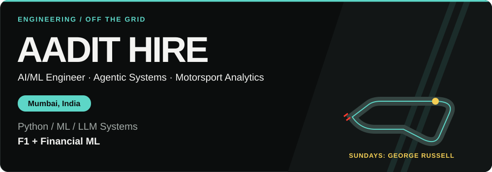
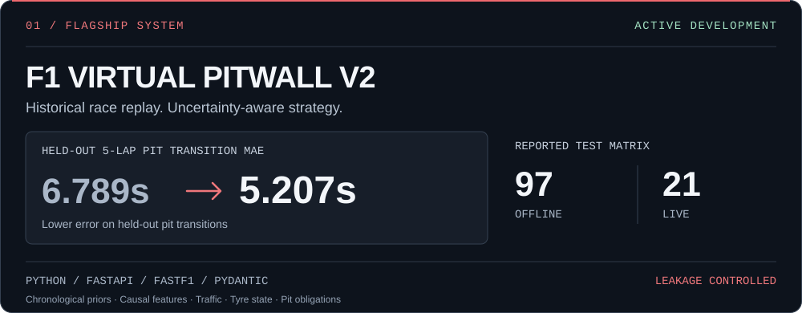
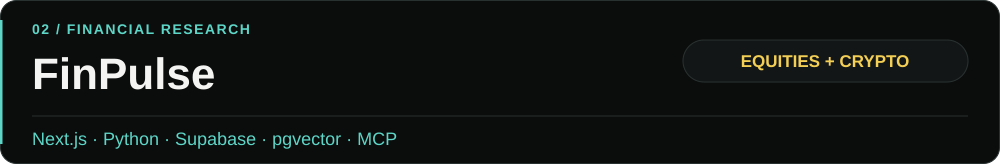
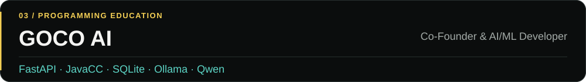
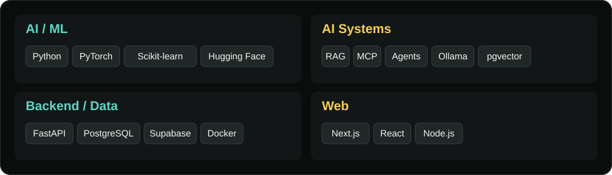
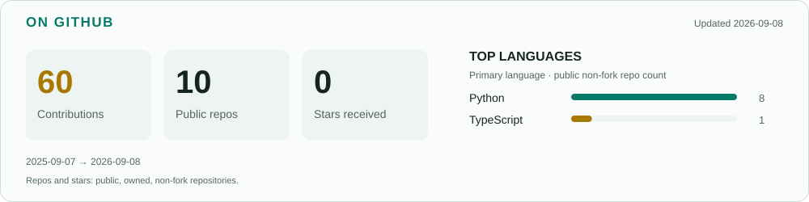

<!-- HERO -->

<!-- ABOUT -->
I'm Aadit, an AI/ML engineer from Mumbai. I like building models that help make useful decisions. Right now, that means race strategy, financial research, and agentic AI. On race weekends, I'm cheering for George Russell.

<!-- PROJECTS -->
## What I'm building

Replays historical races without leaking future information, then models pit, tyre, and traffic decisions.

[View Pitwall →](https://github.com/AaditHire/f1-virtual-pitwall-V2)

A financial research terminal bringing portfolio analytics, SEC/news retrieval, RAG, specialist agents, and MCP tools together.

[View FinPulse →](https://github.com/AaditHire/FinPulse)

AI infrastructure for competitive programming and learning, with learner modelling, coding workflows, and contest-safe assistance.

<!-- GOCO_PUBLIC_URL: add a verified public URL when available. -->

<!-- STACK -->
## Tech I work with

<picture>
  <source media="(max-width: 600px)" srcset="assets/stack-mobile.svg" />
  
</picture>

<!-- TELEMETRY -->
## On GitHub

<picture>
  <source media="(prefers-color-scheme: dark)" srcset="output/github-stats-dark.svg" />
  <source media="(prefers-color-scheme: light)" srcset="output/github-stats.svg" />
  
</picture>

[Repositories](https://github.com/AaditHire?tab=repositories) · [Pitwall commits](https://github.com/AaditHire/f1-virtual-pitwall-V2/commits/main) · [FinPulse commits](https://github.com/AaditHire/FinPulse/commits/main) · [FinPulse workflows](https://github.com/AaditHire/FinPulse/actions)

<!-- DEVELOPMENT LAP -->
## Development lap

<picture>
  <source media="(prefers-color-scheme: dark)" srcset="output/contribution-racer-dark.svg" />
  <source media="(prefers-color-scheme: light)" srcset="output/contribution-racer.svg" />
  
</picture>

<a href="https://github.com/AaditHire?tab=overview">Contribution history</a> · <a href="scripts/GITHUB-VISUALS.md">How it's made</a>

<!-- RESEARCH -->
## Currently exploring

Local LLMs, agent evaluation, race-strategy simulation, financial ML, and reinforcement learning.

<!-- CONTACT -->
---

Have something interesting in mind? [Let's talk.](mailto:hire.aadit@gmail.com)

[GitHub](https://github.com/AaditHire) · [LinkedIn](https://linkedin.com/in/aadit-hire) · [Email](mailto:hire.aadit@gmail.com)
